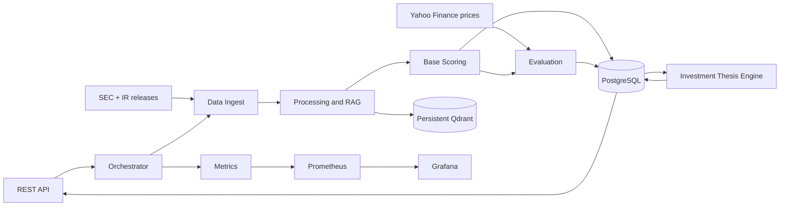
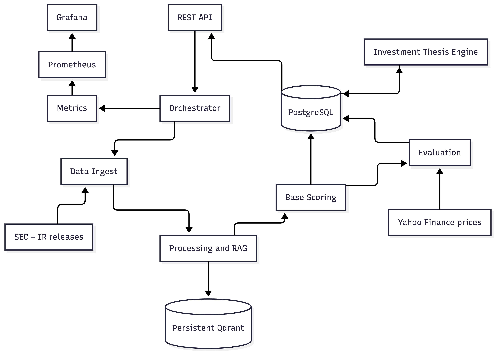

# Personalized Financial Sentiment System

Thesis-focused architecture for applying LLMs and RAG to heterogeneous company
information. The system produces reusable company sentiment first, then applies
an investor's Investment Thesis with transparent deterministic rules.

This document describes the target thesis system and replaces the earlier
architecture drafts. The current code in `poc/` is an initial POC and will be
rebuilt toward this design.

## Scope

### Goals

- Ingest historical company information from multiple sources.
- Extract auditable chunk-level sentiment and importance signals.
- Aggregate signals into company sentiment for explicit time windows.
- Apply company- or group-specific investor theses without another LLM call.
- Preserve the evidence, configuration, and model output behind every result.
- Evaluate sentiment usefulness against subsequent market behavior.

### Non-goals

- Predicting an exact stock price or investment value.
- Production authentication, authorization, or production frontend development.
- Live private company-email integration.
- Cyfronet deployment in the core implementation; it is a stretch goal.

## Requirements

### Functional

- Store investor accounts and company/group-specific Investment Theses.
- Ingest and normalize SEC filings and official investor-relations releases.
- Store historical market prices for evaluation.
- Calculate sentiment and importance for individual document chunks.
- Produce 30-, 90-, and 365-day company sentiment snapshots.
- Return both general sentiment and personalized Investment Thesis results.
- Return explanations and the crucial source chunks used by each result.
- Store prediction history and complete experiment provenance.
- Recompute data and scores in a daily batch, with a manual trigger for experiments.

### Research and evaluation

- Use five years of historical source data and a two-year evaluation period.
- Evaluate forward market outcomes over 1-, 5-, 20-, and 60-trading-day horizons;
  a 252-trading-day horizon is optional.
- Compare the system with a deterministic keyword baseline and a no-signal market
  benchmark.
- Use forward excess return against a sector benchmark, with the S&P 500 as a
  fallback; report S&P 500 sensitivity results.
- Prevent look-ahead bias by starting evaluation on the first trading day after
  document publication.

## Architecture

The system is a modular monolith. Components communicate through explicit
Python interfaces and database contracts; they do not need to be independent
network services for the thesis.


Better view:

### Components

| Component | Responsibility |
|---|---|
| API | Account, Investment Thesis, prediction, history, and ingestion contracts |
| Orchestrator | Coordinates ingestion, scoring, aggregation, personalization, and batch runs |
| Data Ingest | Downloads/accepts source data, parses metadata, cleans text, and normalizes documents |
| Processing and RAG | Creates chunks, embeddings, retrieval context, and contextual-RAG variants |
| Base Scoring | Uses the LLM to score chunk polarity and general importance independently of users |
| Sentiment Aggregator | Produces document and company/window scores from weighted chunk scores |
| Investment Thesis Engine | Applies deterministic, documented personalization rules |
| Evaluation | Joins signals with future market data and calculates research metrics |
| PostgreSQL | Stores users, theses, documents, scores, predictions, runs, and provenance |
| Qdrant | Stores persistent embeddings and searchable chunk payloads |
| Prometheus/Grafana | Exposes and visualizes batch, retrieval, LLM, and evaluation metrics |

## Data Flow

1. Ingest SEC `10-K`, `10-Q`, relevant `8-K`, and official investor-relations earnings releases.
2. Preserve the raw document and create a separately cleaned representation.
3. Parse source, company, publication date, document type, and content metadata.
4. Split documents into chunks and generate real local semantic embeddings.
5. Generate chunk polarity and importance scores with the LLM, independently of users.
6. Store chunks, scores, embeddings, prompts, raw responses, and model metadata.
7. Aggregate chunks into 30-, 90-, and 365-day company snapshots using importance and recency weights.
8. Retrieve the relevant snapshots for an Investment Thesis.
9. Apply deterministic thesis rules to produce the personalized score and label.
10. Persist the result with source evidence, configuration, and experiment run ID.
11. Evaluate the result against future benchmark-adjusted market returns.

## Core Contracts

### Sentiment

```json
{
  "score": 0.0,
  "label": "NEGATIVE",
  "confidence": 0.0
}
```

- `score` is polarity: `0.0` strongly negative, `0.5` neutral, `1.0` strongly positive.
- Initial label mapping is `<0.4` negative, `0.4..0.6` neutral, `>0.6` positive.
- `confidence` is separate from polarity.

### Chunk evidence

```json
{
  "chunk_id": "uuid",
  "document_id": "uuid",
  "company": "AAPL",
  "published_at": "2025-01-30",
  "source": "sec",
  "sentiment_score": 0.72,
  "importance_score": 0.91,
  "excluded": false,
  "content": "..."
}
```

Importance is general evidence value, not investor-specific relevance. Chunks
below `0.05` for three consecutive batch scores are softly excluded from
retrieval but never physically deleted.

### Investment Thesis

```json
{
  "thesis_id": "uuid",
  "user_id": "uuid",
  "companies": ["AAPL"],
  "risk_tolerance": "medium",
  "investment_horizon": "long_term",
  "investment_style": "passive",
  "description": "Optional explanatory text"
}
```

The description is explanatory only. Structured fields drive the deterministic
personalization algorithm.

### Prediction

```json
{
  "company": "AAPL",
  "as_of": "2025-01-30",
  "lookback_days": 90,
  "forecast_horizon_days": 20,
  "base_sentiment": {"score": 0.72, "label": "POSITIVE"},
  "personalized_sentiment": {"score": 0.68, "label": "POSITIVE"},
  "confidence": 0.81,
  "reasoning": "...",
  "sources": [
    {
      "chunk_id": "chunk-uuid",
      "published_at": "2025-01-30",
      "importance_score": 0.91,
      "excerpt": "..."
    }
  ],
  "run_id": "uuid"
}
```

## API Surface

The rebuilt API follows the architecture vocabulary while remaining
non-production and unauthenticated.

| Method | Endpoint | Purpose |
|---|---|---|
| POST | `/user/account` | Create an investor account |
| POST | `/user/strategy` | Create an Investment Thesis for companies/groups |
| PUT | `/user/strategy` | Update an Investment Thesis |
| GET | `/user/strategy` | List a user's company/group theses |
| GET | `/user/strategy/{companyID}` | Get the thesis for a company |
| GET | `/companies/{companyID}/prediction` | Get personalized prediction and evidence |
| GET | `/user/history/{userID}` | Get stored prediction history |
| POST | `/companies/{companyID}` | Accept fixture-based company communication data |
| POST | `/batch/run` | Trigger an experiment or refresh batch |

LLM and storage operations are internal component interfaces, not public user
endpoints.

## Deployment And Observability

Docker Compose is the local integration boundary:

- Application service
- PostgreSQL
- Persistent Qdrant
- Prometheus
- Grafana

The first useful metrics are batch duration and status, documents/chunks
processed, excluded chunks, retrieval counts, LLM calls/errors/latency, token
usage, and evaluation metrics. API keys and other secrets must remain outside
stored experiment artifacts and version control.

## Implementation Status

- The existing `poc/` implementation proves the initial SEC-to-RAG-to-LLM flow.
- The POC uses per-user LLM calls, SQLite, in-memory Qdrant, and mock embeddings by default.
- The thesis implementation must be rebuilt around this two-stage architecture.
- Cyfronet integration, production security, and advanced operational hardening remain outside the core thesis scope.
